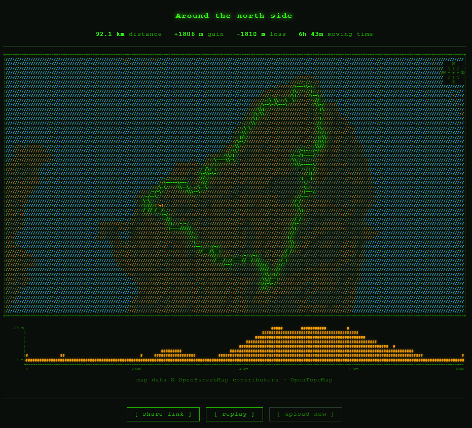

# GPX ASCII Map

Upload a GPX file and get back an animated ASCII art map of the route, complete with terrain shading, place names, an elevation profile, and a shareable link.



## Features

- **Animated route drawing** — the route traces itself across the map character by character
- **Terrain classification** — water, forest/nature, urban, and bare land rendered with distinct characters and colors
- **West-light hillshading** — luminance gradients from the underlying tile imagery add depth to terrain
- **Elevation profile** — bar chart synced to the same animation timeline as the route
- **Place names** — cities, towns, villages, peaks, and landmarks labeled from OpenStreetMap data
- **Compass rose** — inset in the top-right corner
- **Shareable links** — each upload gets a permanent `?s=<id>` URL; the rendered map is stored, the original GPX file is not

## How it works

1. The server parses the uploaded `.gpx` file to extract lat/lon/elevation/time track points
2. Map tiles are fetched from OpenTopoMap at the appropriate zoom level and stitched into a single image
3. The image is classified pixel-by-pixel into terrain types (water, nature, urban, land) using color heuristics tuned for OpenTopoMap's palette
4. A horizontal luminance gradient across the classified image approximates west-side lighting — cells with rising luma west→east are shaded darker
5. Track points are projected onto a fixed 200×56 character canvas (16:9 aspect ratio) and drawn using Bresenham's line algorithm, with directional characters (`-` `|` `/` `\`) chosen based on each segment's bearing
6. Place names are fetched from the Overpass API and placed on the grid, skipping cells already occupied by the route
7. The server stores the rendered HTML map, stats, and bounds as a JSON file keyed by a random 10-character ID; the `?s=<id>` query parameter loads it back

## Running locally

**Prerequisites:** Node.js 18+

```bash
git clone https://github.com/kholland950/gpx-ascii-map
cd gpx-ascii-map
npm install
npm start
```

Open [http://localhost:3000](http://localhost:3000) and drop in a `.gpx` file.

For development with auto-reload:

```bash
npm run dev
```

Rendered routes are saved to `./data/` as JSON files. The directory is created automatically on first run.

## Deployment (Cloud Run + GCS)

The server is stateless when `GCS_BUCKET` is set — route JSON is stored in Cloud Storage instead of local disk, making it suitable for containerized deployment.

**Build and push:**

```bash
export PROJECT=your-gcp-project-id
export REGION=us-central1
export BUCKET=gpx-ascii-map-data
export IMAGE=gcr.io/$PROJECT/gpx-ascii-map

gcloud storage buckets create gs://$BUCKET --project=$PROJECT --location=$REGION
gcloud builds submit --tag $IMAGE --project=$PROJECT
```

**Deploy:**

```bash
gcloud run deploy gpx-ascii-map \
  --image $IMAGE \
  --region $REGION \
  --platform managed \
  --allow-unauthenticated \
  --set-env-vars GCS_BUCKET=$BUCKET \
  --memory 512Mi \
  --cpu 1 \
  --concurrency 10 \
  --min-instances 0 \
  --max-instances 3 \
  --project=$PROJECT
```

**Grant the service account access to the bucket:**

```bash
SA=$(gcloud run services describe gpx-ascii-map \
  --region=$REGION \
  --format='value(spec.template.spec.serviceAccountName)' \
  --project=$PROJECT)

gcloud storage buckets add-iam-policy-binding gs://$BUCKET \
  --member="serviceAccount:$SA" \
  --role="roles/storage.objectUser"
```

## Data sources

| Source | Used for | License |
|--------|----------|---------|
| [OpenTopoMap](https://opentopomap.org) | Map tile imagery (terrain, hillshading, contours) | [CC BY-SA](https://creativecommons.org/licenses/by-sa/3.0/) |
| [OpenStreetMap](https://www.openstreetmap.org/copyright) | Underlying map data in OpenTopoMap tiles | [ODbL](https://opendatacommons.org/licenses/odbl/) |
| [Overpass API](https://overpass-api.de) | Place name labels (cities, towns, peaks, landmarks) | [ODbL](https://opendatacommons.org/licenses/odbl/) |

Attribution is displayed in the UI beneath every rendered map.

## Project structure

```
gpx-ascii-map/
├── server.js          # Express server: GPX parsing, tile fetching, ASCII rendering
├── public/
│   ├── index.html     # Single-page UI
│   ├── app.js         # Upload flow, animation, share/replay controls
│   └── style.css      # Styles and CSS animation keyframes
├── data/              # Local route JSON storage (dev); replaced by GCS in production
├── Dockerfile
└── package.json
```

## Privacy

The original `.gpx` file is never stored. When a route is processed, only the rendered ASCII map HTML, basic stats (distance, elevation, duration), and bounding coordinates are saved. Sharing a link does not expose raw track point data.

## License

MIT
